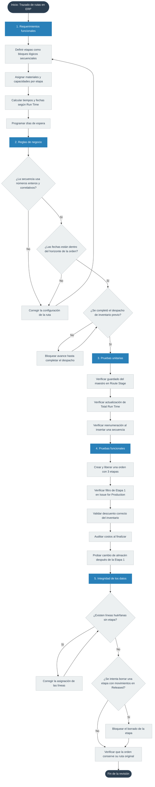

```mermaid
  flowchart TD
    A(["Inicio: Trazado de rutas en ERP"])

    A --> B["1. Requerimientos funcionales"]
    B --> B1["Definir etapas como bloques lógicos secuenciales"]
    B1 --> B2["Asignar materiales y capacidades por etapa"]
    B2 --> B3["Calcular tiempos y fechas según Run Time"]
    B3 --> B4["Programar días de espera"]

    B4 --> C["2. Reglas de negocio"]
    C --> C1{"¿La secuencia usa números enteros y correlativos?"}
    C1 -->|Sí| C2{"¿Las fechas están dentro del horizonte de la orden?"}
    C1 -->|No| R["Corregir la configuración de la ruta"]
    C2 -->|No| R
    R --> B1
    C2 -->|Sí| C3{"¿Se completó el despacho de inventario previo?"}
    C3 -->|No| C4["Bloquear avance hasta completar el despacho"]
    C4 --> C3

    C3 -->|Sí| D["3. Pruebas unitarias"]
    D --> D1["Verificar guardado del maestro en Route Stage"]
    D1 --> D2["Verificar actualización de Total Run Time"]
    D2 --> D3["Verificar reenumeración al insertar una secuencia"]

    D3 --> E["4. Pruebas funcionales"]
    E --> E1["Crear y liberar una orden con 3 etapas"]
    E1 --> E1a["Verificar filtro de Etapa 1 en Issue for Production"]
    E1a --> E1b["Validar descuento correcto del inventario"]
    E1b --> E1c["Auditar costos al finalizar"]
    E1c --> E2["Probar cambio de almacén después de la Etapa 1"]

    E2 --> F["5. Integridad de los datos"]
    F --> F1{"¿Existen líneas huérfanas sin etapa?"}
    F1 -->|Sí| F1a["Corregir la asignación de las líneas"]
    F1a --> F1
    F1 -->|No| F2{"¿Se intenta borrar una etapa con movimientos en Released?"}
    F2 -->|Sí| F2a["Bloquear el borrado de la etapa"]
    F2 -->|No| F3["Verificar que la orden conserve su ruta original"]
    F2a --> F3
    F3 --> Z(["Fin de la revisión"])

    classDef main fill:#2c3e50,stroke:#34495e,stroke-width:2px,color:#fff;
    classDef category fill:#2980b9,stroke:#2980b9,stroke-width:2px,color:#fff;
    classDef item fill:#ecf0f1,stroke:#bdc3c7,stroke-width:1px,color:#2c3e50;

    class A,Z main;
    class B,C,D,E,F category;
    class B1,B2,B3,B4,C1,C2,C3,C4,R,D1,D2,D3,E1,E1a,E1b,E1c,E2,F1,F1a,F2,F2a,F3 item;
```
